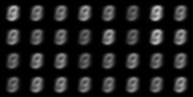
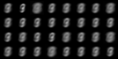

# AutoEncoders


The main script can be run by using:

```
python3 main.py
```

- Which will use Mean squared error by default

The output after 20 epochs of the number '9' is:



For using Binary Cross Entropy loss, run:

```l
python3 main.py --loss=nn.BCELoss --config=config/auto_sigmoid_config.gin --epochs=50
```

- This gives the output:





In general the Binary cross-entropy loss is preferred when the last layer is a sigmoid.  This is because the 'log' in the loss equation is well canceled out by the exponential in the sigmoid.  Here it can be shown to have sharper results.  In the Mean-Squared error example we do not use sigmoid in the output layer.


## Other

Our Auto Encoder is built in the files:

```
models/Autoencoder.py
utils/abc_module.py
```

- *abc\_modle.py*:
  - This contains an abstract class for creating a fully connected network.  The input/output features are specified along with the hidden layers, number of nodes and activation functions.  The encoder/decoder classes in *models/Autoencoder.py* rely on this.
- Parameters are selected using [gin-config](https://pypi.org/project/gin-config/) and the files config/auto\_*\_config.gin

