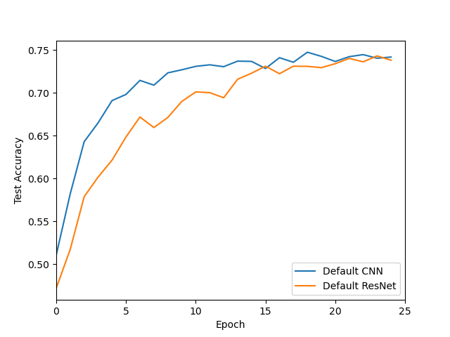

# ResNets
Repository consisting of the following implementations:
1. [Comparing Conventional CNN & ResNet](#comparing-conventional-cnn-and-resnet)
    - [Network details](#network-details)
    - [Run code](#run-code)
    - [Results](#results)
    
2. [Achieving 85% Accuracy with ResNets](#achieving-high-accuracy-with-resnets)
    - [Network details](#network-details-1)
    - [Run code](#run-code-1)
    - [Results](#results-1)
    
## Comparing Conventional CNN and ResNet
An attempt to compare CNN & ResNet using [CIFAR-10](https://www.cs.toronto.edu/~kriz/cifar.html) for a classification tasks constiting of 10 classes. <br>
The following hyperparameters/functions were used:

|S.No|Item| Value |
|---|---|---|
|1| Epochs | 25|
|2| Learning Rate |0.0005 |
|3| Adam | beta_1 = 0.9; beta_2 = 0.95 |
|4| Loss | Cross-Entropy |

### Network details
- CNN :

```
==========================================================================================
Layer (type:depth-idx)                   Output Shape              Param #
==========================================================================================
├─ModuleList: 1                          []                        --
|    └─Conv2d: 2-1                       [-1, 32, 30, 30]          896
|    └─Conv2d: 2-2                       [-1, 32, 28, 28]          9,248
|    └─ReLU: 2-3                         [-1, 32, 28, 28]          --
|    └─MaxPool2d: 2-4                    [-1, 32, 14, 14]          --
|    └─Conv2d: 2-5                       [-1, 64, 12, 12]          18,496
|    └─Conv2d: 2-6                       [-1, 64, 10, 10]          36,928
|    └─ReLU: 2-7                         [-1, 64, 10, 10]          --
|    └─MaxPool2d: 2-8                    [-1, 64, 5, 5]            --
|    └─MLP: 2-9                          [-1, 10]                  --
==========================================================================================
Total params: 65,568
Trainable params: 65,568
Non-trainable params: 0
Total mult-adds (M): 14.38
==========================================================================================
```
- ResNet :

```
==========================================================================================
Layer (type:depth-idx)                   Output Shape              Param #
==========================================================================================
├─ModuleList: 1                          []                        --
|    └─Conv2d: 2-1                       [-1, 32, 16, 16]          4,736
|    └─BatchNorm2d: 2-2                  [-1, 32, 16, 16]          64
|    └─ReLU: 2-3                         [-1, 32, 16, 16]          --
|    └─ResBlock: 2-4                     [-1, 32, 16, 16]          --
|    |    └─Conv2d: 3-1                  [-1, 32, 16, 16]          9,248
|    |    └─BatchNorm2d: 3-2             [-1, 32, 16, 16]          64
|    |    └─ReLU: 3-3                    [-1, 32, 16, 16]          --
|    |    └─Conv2d: 3-4                  [-1, 32, 16, 16]          9,248
|    |    └─BatchNorm2d: 3-5             [-1, 32, 16, 16]          64
|    |    └─ReLU: 3-6                    [-1, 32, 16, 16]          --
|    └─Conv2d: 2-5                       [-1, 64, 8, 8]            18,496
|    └─BatchNorm2d: 2-6                  [-1, 64, 8, 8]            128
|    └─ReLU: 2-7                         [-1, 64, 8, 8]            --
|    └─ResBlock: 2-8                     [-1, 64, 8, 8]            --
|    |    └─Conv2d: 3-7                  [-1, 64, 8, 8]            36,928
|    |    └─BatchNorm2d: 3-8             [-1, 64, 8, 8]            128
|    |    └─ReLU: 3-9                    [-1, 64, 8, 8]            --
|    |    └─Conv2d: 3-10                 [-1, 64, 8, 8]            36,928
|    |    └─BatchNorm2d: 3-11            [-1, 64, 8, 8]            128
|    |    └─ReLU: 3-12                   [-1, 64, 8, 8]            --
|    └─Conv2d: 2-9                       [-1, 128, 4, 4]           73,856
|    └─BatchNorm2d: 2-10                 [-1, 128, 4, 4]           256
|    └─ReLU: 2-11                        [-1, 128, 4, 4]           --
|    └─ResBlock: 2-12                    [-1, 128, 4, 4]           --
|    |    └─Conv2d: 3-13                 [-1, 128, 4, 4]           147,584
|    |    └─BatchNorm2d: 3-14            [-1, 128, 4, 4]           256
|    |    └─ReLU: 3-15                   [-1, 128, 4, 4]           --
|    |    └─Conv2d: 3-16                 [-1, 128, 4, 4]           147,584
|    |    └─BatchNorm2d: 3-17            [-1, 128, 4, 4]           256
|    |    └─ReLU: 3-18                   [-1, 128, 4, 4]           --
|    └─AvgPool2d: 2-13                   [-1, 128, 2, 2]           --
|    └─MLP: 2-14                         [-1, 10]                  --
==========================================================================================
Total params: 485,952
Trainable params: 485,952
Non-trainable params: 0
Total mult-adds (M): 19.17
==========================================================================================
```
### Run Code
```bash
comparison_cnn_resnets.py
```

### Results
After 25 epochs :

|Network|Accuracy
|---|---|
|CNN| 74.2% |
|ResNet| 73.8%|




### Achieving High Accuracy with Resnets
**Goal** is to achieve 85% Test Accuracy with parameters under 500,000. 

The following **hyperparameters/functions** were used:

|S.No|Item| Value |
|---|---|---|
|1| Epochs | 150|
|2| Learning Rate | Initial rate= 0.005; <br>Final Rate= 0.000005 <br> (decreased by 0.1 after few epochs)|
|3| Adam | beta_1 = 0.9 <br> beta_2 = 0.95 |
|4| Loss | Cross-Entropy |
|5| Batch Norm | After every Conv2d layer |
|6| Dropout | Not used |
|7| Adam | beta_1 = 0.9; beta_2 = 0.95 |
|8| Loss | Cross-Entropy |

The following data augmentations were used:
- RandomRotation
- RandomCrop
- ColorJitter
- RandomVerticalFlip
- RandomHorizontalFlip


### Network details

```
==========================================================================================
Layer (type:depth-idx)                   Output Shape              Param #
==========================================================================================
├─ModuleList: 1                          []                        --
|    └─Conv2d: 2-1                       [-1, 32, 16, 16]          4,736
|    └─BatchNorm2d: 2-2                  [-1, 32, 16, 16]          64
|    └─ReLU: 2-3                         [-1, 32, 16, 16]          --
|    └─ResBlock: 2-4                     [-1, 32, 16, 16]          --
|    |    └─Conv2d: 3-1                  [-1, 32, 16, 16]          9,248
|    |    └─BatchNorm2d: 3-2             [-1, 32, 16, 16]          64
|    |    └─ReLU: 3-3                    [-1, 32, 16, 16]          --
|    |    └─Conv2d: 3-4                  [-1, 32, 16, 16]          9,248
|    |    └─BatchNorm2d: 3-5             [-1, 32, 16, 16]          64
|    |    └─ReLU: 3-6                    [-1, 32, 16, 16]          --
|    └─ResBlock: 2-5                     [-1, 32, 16, 16]          (recursive)
|    |    └─Conv2d: 3-7                  [-1, 32, 16, 16]          (recursive)
|    |    └─BatchNorm2d: 3-8             [-1, 32, 16, 16]          (recursive)
|    |    └─ReLU: 3-9                    [-1, 32, 16, 16]          --
|    |    └─Conv2d: 3-10                 [-1, 32, 16, 16]          (recursive)
|    |    └─BatchNorm2d: 3-11            [-1, 32, 16, 16]          (recursive)
|    |    └─ReLU: 3-12                   [-1, 32, 16, 16]          --
|    └─Conv2d: 2-6                       [-1, 64, 8, 8]            18,496
|    └─BatchNorm2d: 2-7                  [-1, 64, 8, 8]            128
|    └─ReLU: 2-8                         [-1, 64, 8, 8]            --
|    └─ResBlock: 2-9                     [-1, 64, 8, 8]            --
|    |    └─Conv2d: 3-13                 [-1, 64, 8, 8]            36,928
|    |    └─BatchNorm2d: 3-14            [-1, 64, 8, 8]            128
|    |    └─ReLU: 3-15                   [-1, 64, 8, 8]            --
|    |    └─Conv2d: 3-16                 [-1, 64, 8, 8]            36,928
|    |    └─BatchNorm2d: 3-17            [-1, 64, 8, 8]            128
|    |    └─ReLU: 3-18                   [-1, 64, 8, 8]            --
|    └─ResBlock: 2-10                    [-1, 64, 8, 8]            (recursive)
|    |    └─Conv2d: 3-19                 [-1, 64, 8, 8]            (recursive)
|    |    └─BatchNorm2d: 3-20            [-1, 64, 8, 8]            (recursive)
|    |    └─ReLU: 3-21                   [-1, 64, 8, 8]            --
|    |    └─Conv2d: 3-22                 [-1, 64, 8, 8]            (recursive)
|    |    └─BatchNorm2d: 3-23            [-1, 64, 8, 8]            (recursive)
|    |    └─ReLU: 3-24                   [-1, 64, 8, 8]            --
|    └─Conv2d: 2-11                      [-1, 128, 4, 4]           73,856
|    └─BatchNorm2d: 2-12                 [-1, 128, 4, 4]           256
|    └─ReLU: 2-13                        [-1, 128, 4, 4]           --
|    └─ResBlock: 2-14                    [-1, 128, 4, 4]           --
|    |    └─Conv2d: 3-25                 [-1, 128, 4, 4]           147,584
|    |    └─BatchNorm2d: 3-26            [-1, 128, 4, 4]           256
|    |    └─ReLU: 3-27                   [-1, 128, 4, 4]           --
|    |    └─Conv2d: 3-28                 [-1, 128, 4, 4]           147,584
|    |    └─BatchNorm2d: 3-29            [-1, 128, 4, 4]           256
|    |    └─ReLU: 3-30                   [-1, 128, 4, 4]           --
|    └─ResBlock: 2-15                    [-1, 128, 4, 4]           (recursive)
|    |    └─Conv2d: 3-31                 [-1, 128, 4, 4]           (recursive)
|    |    └─BatchNorm2d: 3-32            [-1, 128, 4, 4]           (recursive)
|    |    └─ReLU: 3-33                   [-1, 128, 4, 4]           --
|    |    └─Conv2d: 3-34                 [-1, 128, 4, 4]           (recursive)
|    |    └─BatchNorm2d: 3-35            [-1, 128, 4, 4]           (recursive)
|    |    └─ReLU: 3-36                   [-1, 128, 4, 4]           --
|    └─AvgPool2d: 2-16                   [-1, 128, 2, 2]           --
|    └─MLP: 2-17                         [-1, 10]                  --
==========================================================================================
Total params: 485,952
Trainable params: 485,952
Non-trainable params: 0
Total mult-adds (M): 32.66
==========================================================================================
```

### Run Code

```bash
resnets.py
```

### Results
Trained ResNets achieved an accuracy of 85.0%. <br> 
Total trainable parameters = 485,952 <br>

- Training from starch:

 


- Using a saved model and continuing training:

 

```bash
Final model location: "./save/ResNet2_accuracy-85_checkpoints/model_epoch_50.pt" 
```

